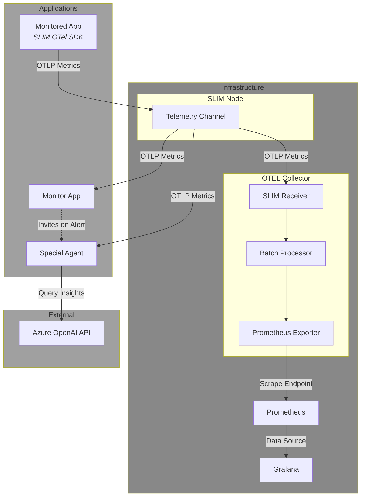

# Observability Demo Application

This application shows how to use SLIM for a simple AI-powered root cause analysis of application performance issues.

## Applications

### 1. Monitored Application (`monitored_app`)
Simulates an application that receives and serves requests. It cycles between periods of low and high request load to simulate different traffic patterns:
- **Low Load Period**: 20 seconds with low request volume (latency around 50ms, few connections)
- **High Load Period**: 20 seconds with high request volume (high latency over 200ms due to higher connections)
- **Automatic Cycling**: Continuously alternates between these states

The application produces two metrics via OpenTelemetry based on the simulated load:
- `processing_latency_ms`: Request processing latency (increases under high load)
- `active_connections`: Number of active connections (higher during peak load)

The application uses the SLIM OTel SDK to export metrics directly to a SLIM channel.

### 2. Monitor Application (`monitor_app`)
Creates and manages the SLIM channel for telemetry monitoring.
- Creates the SLIM channel and invites both the monitored application and the OTEL collector as participants
- Processes metrics coming from the SLIM channel in real-time
- Detects performance anomalies (service latency > 200ms)
- Invites the Special Agent to the analysis session when issues are detected
- Removes the Special Agent after analysis is complete

### 3. Special Agent (`special_agent`)
An agent that performs root cause analysis:
- Waits for invitation from the Monitor Application
- Collects metrics for 10 seconds once invited
- Performs statistical analysis (mean, standard deviation, min/max values)
- Uses Azure OpenAI to generate insights and actionable recommendations
- Notifies the Monitor Application when the analysis is done

## Architecture



### Data Flow

1. **Monitor Application** starts up and creates a telemetry SLIM channel, inviting the **Monitored Application** and the **OTEL Collector** as participants

2. **Monitored Application** generates metrics using the SLIM OTel SDK and sends them directly to the SLIM channel via OTLP. The SLIM node broadcasts these metrics to all channel participants

3. **OTEL Collector** receives the telemetry through its SLIM Receiver component, processes the metrics through a batch processor, and exposes them via a Prometheus exporter. **Prometheus** continuously scrapes metrics from the OTEL Collector's endpoint. **Grafana** connects to Prometheus as a data source and visualizes the metrics through dashboards

4. **Monitor Application** simultaneously receives the same telemetry stream from the SLIM channel and continuously analyzes the metrics in real-time to detect performance issues

5. When the **Monitor Application** detects high latency (consecutive samples above 200ms threshold), it invites the **Special Agent** to join the SLIM channel session

6. **Special Agent** begins receiving metrics from the SLIM channel, collects data for 10 seconds, performs statistical analysis, and queries **Azure OpenAI** to identify the root cause of the performance degradation

7. **Special Agent** reports its findings back to the Monitor Application and leaves the session, allowing the cycle to repeat

## Configuration Files

- **`builder-config.yaml`**: Defines OpenTelemetry Collector components (SLIM receiver/exporter, Prometheus exporter)
- **`collector-config.yaml`**: Runtime configuration for the collector (receivers, processors, exporters, pipelines)
- **`slim-config.yaml`**: SLIM node configuration (shared secret, certificates)
- **`docker-compose.yaml`**: Infrastructure services orchestration
- **`grafana-datasources.yaml`**: Grafana Prometheus data source configuration
- **`graphana-dashboard.json`** (note: typo in filename): Pre-built Grafana dashboard for visualization

## Prerequisites

- Go 1.26.1 or later
- Docker and Docker Compose
- [Task](https://taskfile.dev/) (task runner)
- Azure OpenAI API credentials (required only for the Special Agent)

## Setup Instructions

### 1. Build the Custom Collector

Build the OpenTelemetry Collector with SLIM components as a Docker image:

```bash
task collector:docker:build
```

This will:
- Install OpenTelemetry Collector Builder (ocb)
- Generate the collector code with SLIM receiver and exporter using the **`builder-config.yaml`** file
- Create a Docker image for the collector based on the **`Dockerfile`**

### 2. Start Infrastructure

Start all infrastructure services:

```bash
task infra:start
```

This will start the SLIM Node, the OTEL Collector, Prometheus, and Grafana

Verify all services are running:

```bash
task infra:status
```

### 3. Configure Grafana Dashboard

1. Open Grafana at http://localhost:3000
2. Login with credentials: `admin` / `admin`
3. Navigate to **Dashboards** → **Import**
4. Upload the `graphana-dashboard.json` file

### 4. Run the Applications

Open three separate terminal windows and run each application:

**Terminal 1 - Monitored Application:**
```bash
task monitored-application:run
```

**Terminal 2 - Monitor Application:**
```bash
task monitor-application:run
```

**Terminal 3 - Special Agent:**
The Special Agent requires Azure OpenAI credentials. Export your credentials as environment variables before running the Special Agent.
```bash
export AZURE_OPENAI_API_KEY="your-api-key"
export AZURE_OPENAI_ENDPOINT="https://your-endpoint.openai.azure.com/"
export AZURE_OPENAI_DEPLOYMENT="gpt-4o"  # Optional, defaults to gpt-4o
task special-agent:run
```

### 5. Observe the Demo

1. Watch the terminal outputs to see the cycle:
   - Monitored application will cycle through normal and high latency states
   - Monitor application will detect high latency after 5 consecutive samples > 200ms
   - Monitor application will invite the Special Agent
   - Special Agent will collect metrics and perform AI analysis
   - Special Agent will send analysis results and disconnect
   - Monitor application will reset and wait for the next cycle

2. View metrics in Grafana:
   - Open http://localhost:3000
   - Navigate to the imported dashboard
   - Observe `Active Connections` and `Service Latency` metrics

## Stopping the Demo

Stop the applications by pressing `Ctrl+C` in each terminal.

Stop the infrastructure:

```bash
task infra:stop
```
