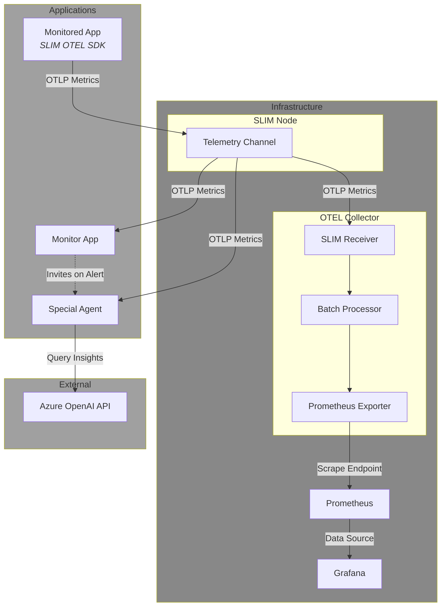

# Observability Demo Application

This application shows how to use SLIM for a simple AI-powered root cause analysis of application performance issues.

## Applications

### 1. Monitored Application (`monitored_app`)
Simulates an application that receives and serves requests. It cycles between periods of low and high request load to simulate differt traffic patterns:
- **Low Load Period**: 20 seconds with low request volume (latency around 50ms, few connections)
- **High Load Period**: 20 seconds with high request volume (high latecy over 200ms due to higher connections)
- **Automatic Cycling**: Continuously alternates between these states

The application produces two metrics via OpenTelemetry based on the simulated load:
- `processing_latency_ms`: Request processing latency (increases under high load)
- `active_connections`: Number of active connections (higher during peak load)

### 2. Monitor Application (`monitor_app`)
Creates and manages the SLIM channel for telemetry monitoring.
- Creates the SLIM channel and invites both the monitored application and the OTEL collector as participants
- Processes metrics coming from the SLIM channel in real-time
- Detects performance anomalies (service latency > 200ms)
- Invites the Special Agent to the analysis session when issues are detected
- Removes the Special Agent after analysis is complete

### 3. Special Agent (`special_agent`)
An AI-powered analysis agent that performs root cause analysis:
- Waits for invitation from the Monitor Agent
- Collects metrics for 10 seconds once invited
- Performs statistical analysis (mean, standard deviation, min/max values)
- Uses a model to generate insights and actionable recommendations
- Notifies the Monitor Application when the analisys is done

## Architecture



### Data Flow

1. **Monitored Application** generates metrics and sends them to the **SLIM Node** via OTLP
2. **SLIM Node** distributes the metrics to:
   - **OTEL Collector** for persistence and Prometheus export
   - **Monitor Agent** for real-time monitoring
   - **Special Agent** (when invited) for analysis
3. **OTEL Collector** exposes a Prometheus scrape endpoint on port 8889
4. **Monitor Agent** watches for latency spikes and invites **Special Agent** when issues are detected
5. **Special Agent** collects metrics, analyzes them with **Azure OpenAI**, and reports findings
6. **Prometheus** scrapes metrics from the collector and stores them
7. **Grafana** visualizes metrics from Prometheus

## Configuration Files

- **`builder-config.yaml`**: Defines OpenTelemetry Collector components (SLIM receiver/exporter, Prometheus exporter)
- **`collector-config.yaml`**: Runtime configuration for the collector (receivers, processors, exporters, pipelines)
- **`slim-config.yaml`**: SLIM node configuration (shared secret, certificates)
- **`docker-compose.yaml`**: Infrastructure services orchestration
- **`grafana-datasources.yaml`**: Grafana Prometheus data source configuration
- **`graphana-dashboard.json`** (note: typo in filename): Pre-built Grafana dashboard for visualization

## Prerequisites

- Go 1.26.1 or later
- Docker and Docker Compose
- [Task](https://taskfile.dev/) (task runner)
- Azure OpenAI API credentials (for Special Agent)

## Setup Instructions

### 1. Build the Custom Collector

Build the OpenTelemetry Collector with SLIM components as a Docker image:

```bash
task collector:docker:build
```

This will:
- Install OpenTelemetry Collector Builder (ocb) v0.145.0
- Generate the collector code with SLIM receiver and exporter
- Download Go dependencies
- Set up SLIM native bindings
- Build the collector binary with CGO enabled
- Create a Docker image

### 2. Start Infrastructure

Start all infrastructure services (SLIM, Collector, Prometheus, Grafana):

```bash
task infra:start
```

This will start:
- **SLIM Node** on port 46357
- **OTEL Collector** on port 8889 (Prometheus scrape endpoint)
- **Prometheus** on port 9090
- **Grafana** on port 3000 (login: admin/admin)

Verify all services are running:

```bash
task infra:status
```

### 3. Configure Grafana Dashboard

1. Open Grafana at http://localhost:3000
2. Login with credentials: `admin` / `admin`
3. Navigate to **Dashboards** → **Import**
4. Upload the `graphana-dashboard.json` file
5. Select the Prometheus data source
6. Click **Import**

### 4. Set Up Azure OpenAI Credentials

Export your Azure OpenAI credentials as environment variables:

```bash
export AZURE_API_KEY="your-api-key"
export AZURE_OPENAI_ENDPOINT="https://your-endpoint.openai.azure.com/"
```

### 5. Run the Applications

Open three separate terminal windows and run each application:

**Terminal 1 - Monitored Application:**
```bash
task monitored-application:run
```

**Terminal 2 - Monitor Agent:**
```bash
task monitor-application:run
```

**Terminal 3 - Special Agent:**
```bash
task special-agent:run
```

### 6. Observe the Demo

1. Watch the terminal outputs to see the cycle:
   - Monitored app will cycle through normal and high latency states
   - Monitor agent will detect high latency after 5 consecutive samples > 200ms
   - Monitor agent will invite the Special Agent
   - Special Agent will collect metrics and perform AI analysis
   - Special Agent will send analysis results and disconnect
   - Monitor agent will reset and wait for the next cycle

2. View metrics in Grafana:
   - Open http://localhost:3000
   - Navigate to the imported dashboard
   - Observe `processing_latency_ms` and `active_connections` metrics

3. Query Prometheus directly (optional):
   - Open http://localhost:9090
   - Search for metrics: `processing_latency_ms`, `active_connections`

## Available Task Commands

### Collector Management
- `task collector:build` - Build the collector locally
- `task collector:docker:build` - Build the collector Docker image
- `task collector:run` - Run the collector locally
- `task collector:clean` - Clean the collector build directory

### Infrastructure Management
- `task infra:start` - Start all infrastructure services
- `task infra:stop` - Stop all infrastructure services
- `task infra:logs` - View logs from all services
- `task infra:status` - Check status of all services

### Application Runners
- `task monitored-application:run` - Run the monitored application
- `task monitor-application:run` - Run the monitor agent
- `task special-agent:run` - Run the special agent

## Stopping the Demo

Stop the applications by pressing `Ctrl+C` in each terminal.

Stop the infrastructure:

```bash
task infra:stop
```

## Troubleshooting

### Collector Build Issues
If the collector build fails, clean and rebuild:
```bash
task collector:clean
task collector:docker:build
```

### SLIM Connection Issues
Verify SLIM is running and accessible:
```bash
docker logs observability_app-slim-1
```

### Missing Native Bindings
The SLIM bindings require CGO and are set up automatically during build. If you encounter issues, ensure:
- CGO is enabled (`CGO_ENABLED=1`)
- The `slim-bindings-setup` step completed successfully

### Azure OpenAI Issues
Ensure environment variables are set correctly:
```bash
echo $AZURE_API_KEY
echo $AZURE_OPENAI_ENDPOINT
```

## Architecture Notes

- **SLIM Protocol**: Provides secure, low-latency message passing between components
- **Channel-based Communication**: All telemetry flows through a shared SLIM channel
- **Session-based Invitations**: Monitor agent dynamically invites Special Agent only when needed
- **Stateless Agents**: Both monitor and special agents can restart without losing context
- **Continuous Cycling**: The demo runs indefinitely, showcasing automated monitoring and analysis

## License

See the LICENSE file in the repository root.
