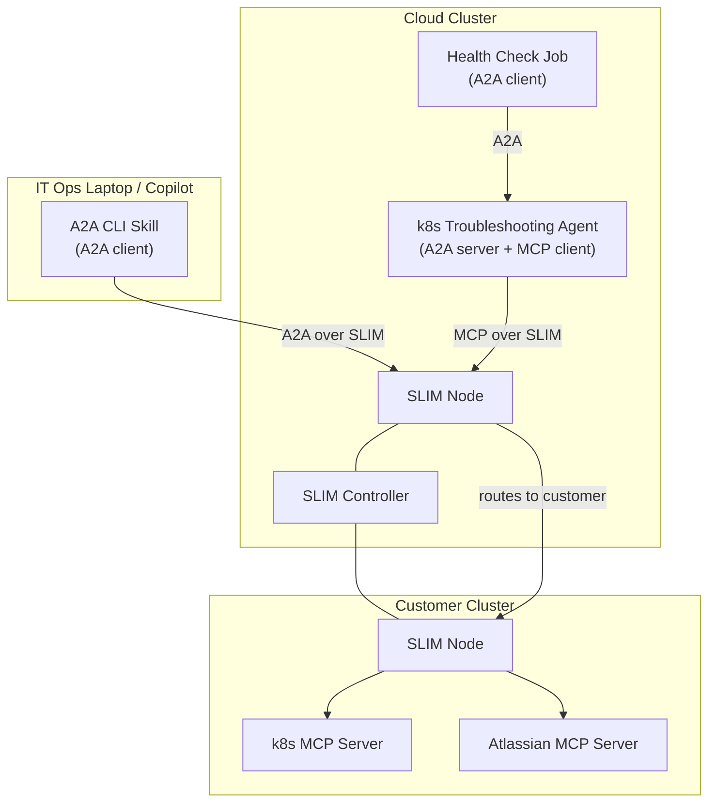

# SLIM Multicluster Customer Remediation with AI Agents

This folder contains all the code and configuration required to replicate the demo described in the blog post
[SLIM MVP: Multicluster Customer Remediation with AI Agents](https://blogs.agntcy.org/technical/2026/04/21/mvp-ai-agents-multicluster.html).

The demo showcases a multicluster customer-remediation scenario built on [SLIM](https://docs.agntcy.org/slim/overview/).
A customer cluster stays private, a cloud-hosted troubleshooting agent stays reachable, and both operators
and automation work across that boundary without exposing the services involved.
It combines [A2A](https://a2a-protocol.org/latest/) for agent-to-agent interaction,
[MCP](https://modelcontextprotocol.io/) for tool access into Kubernetes and Jira,
and [SPIRE](https://spiffe.io/spire/) for workload identity.

## Architecture

## Folder structure

| Folder | Description |
|---|---|
| [`a2acli-skill/`](a2acli-skill/) | A CLI tool and Copilot skill for interacting with agents that expose the A2A protocol. |
| [`k8s-troubleshooting-agent/`](k8s-troubleshooting-agent/) | An AI agent that diagnoses Kubernetes cluster issues by inspecting pod health and logs, and automatically creates Jira tickets via MCP. |
| [`k8s-health-check-job/`](k8s-health-check-job/) | A Kubernetes CronJob that periodically monitors customer cluster health by invoking the troubleshooting agent through A2A. |
| [`deployment/`](deployment/) | Kubernetes manifests and Helm charts for both the **cloud cluster** and the **customer cluster**. |
| [`laptop-setup/`](laptop-setup/) | Step-by-step guide and scripts for IT-Ops operators to run a SPIRE agent on macOS, authenticate with the remote SLIM data plane, and use `a2acli` from the command line or as a GitHub Copilot skill. |
