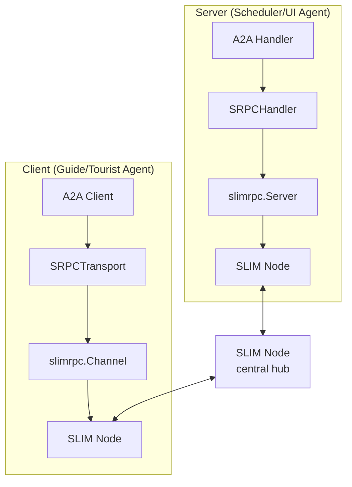
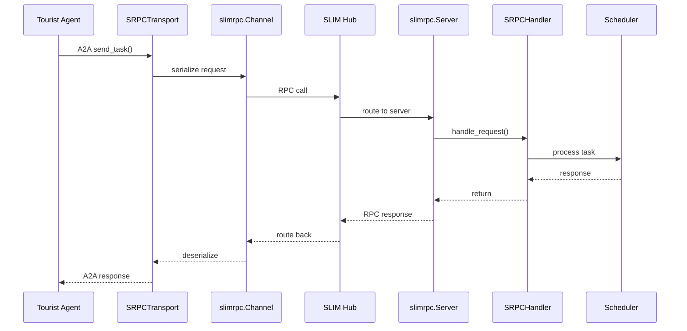

# Multi-Agent Tourist Scheduling System

Multi-agent tourist scheduling system with real-time UI and autonomous LLM-powered agents using the official A2A Python SDK.

## 🌟 Features

- **Real-time Web Dashboard**: Live monitoring of agent activities with WebSocket updates
- **Autonomous LLM Agents**: GPT-4o powered guide and tourist agents with intelligent decision-making
- **A2A Protocol Compliance**: Full implementation using official A2A Python SDK
- **Multi-Agent Coordination**: Scheduler orchestrates complex agent interactions
- **Dynamic Market Simulation**: Agents adapt pricing and behavior based on market conditions
- **SLIM Transport Support**: Encrypted group messaging via MLS protocol

## 📁 Project Structure

```
tourist_scheduling_system/
├── src/
│   ├── agents/                          # Agent implementations
│   │   ├── scheduler_agent.py           # Central coordinator (A2A server)
│   │   ├── guide_agent.py               # Basic guide agent (A2A client)
│   │   ├── tourist_agent.py             # Basic tourist agent (A2A client)
│   │   ├── ui_agent.py                  # Real-time dashboard (hybrid)
│   │   ├── autonomous_guide_agent.py    # LLM-powered guide agent
│   │   ├── autonomous_guide_server.py   # Guide agent A2A server mode
│   │   ├── autonomous_tourist_agent.py  # LLM-powered tourist agent
│   │   └── autonomous_tourist_server.py # Tourist agent A2A server mode
│   └── core/                            # Core components
│       ├── messages.py                  # Message schemas (GuideOffer, TouristRequest, etc.)
│       └── slim_transport.py            # SLIM group transport layer
├── scripts/                             # Demo and utility scripts
│   ├── run_with_ui.sh                   # Main demo launcher with UI
│   ├── run_slim_system.py               # SLIM transport demo script
│   ├── run_slim_demo.py                 # SLIM transport test script
│   ├── run_demo.sh                      # Basic demo launcher
│   ├── populate_dashboard.py            # Dashboard test data generator
│   └── demo_system_status.py            # System status checker
├── tests/                               # Unit tests
│   ├── test_scheduler_matching.py       # Scheduler algorithm tests
│   ├── test_autonomous_guide_agent.py   # Guide agent tests
│   ├── test_autonomous_tourist_agent.py # Tourist agent tests
│   └── test_ui_agent.py                 # UI agent tests
├── a2a_cards/                           # A2A agent card definitions
├── oasf_records/                        # OASF agent records
├── start.sh                             # Unified demo launcher
├── slim-config.yaml                     # SLIM configuration
└── pyproject.toml                       # Project dependencies
```

## 🚀 Quick Start

### Installation

1. Clone the repository:
```bash
git clone https://github.com/agntcy/agentic-apps.git
cd agentic-apps/tourist_scheduling_system
```

2. Create and activate a uv-managed virtual environment (recommended):
```bash
uv venv .venv
source .venv/bin/activate  # Linux/Mac
# .venv\Scripts\activate   # Windows
```

3. Sync dependencies directly from `pyproject.toml` using uv:
```bash
uv sync
```

4. (Alternative ephemeral run) You can skip environment activation and run any command with on-demand resolution:
```bash
uv run python -m agents.scheduler_agent --host localhost --port 10010
```

### Basic Demo

1. **Start the Scheduler**:
```bash
uv run python src/agents/scheduler_agent.py --host localhost --port 10010
```

2. **Start the Real-time Dashboard**:
```bash
uv run python src/agents/ui_agent.py --host localhost --port 10011 --a2a-port 10012
```

3. **Send Agent Interactions**:
```bash
uv run python src/agents/guide_agent.py --scheduler-url http://localhost:10010 --guide-id "florence-guide"
uv run python src/agents/tourist_agent.py --scheduler-url http://localhost:10010 --tourist-id "alice-tourist"
```

4. **View Dashboard**: Open http://localhost:10011 to see real-time updates

### ⚡ Quick Start with start.sh

The unified `start.sh` script supports multiple transport modes:

```bash
# HTTP transport (default) - uses A2A over HTTP
./start.sh

# SLIM transport - encrypted group messaging via MLS
./start.sh --transport slim

# With autonomous agents (HTTP)
./start.sh --autonomous --auto-duration 5

# With autonomous agents (SLIM)
./start.sh --transport slim --auto-duration 5 --auto-limit-guides 3 --auto-limit-tourists 4
```

See [SLIM Transport Support](#-slim-transport-support) for detailed SLIM configuration.

### 🤖 Autonomous LLM Demo

For Azure OpenAI powered autonomous agents (works seamlessly with uv):

1. Set up environment variables (either export manually, source a shell env file like `~/.env-phoenix`, or create a `.env` in this directory – the agent will read existing process env and optionally `.env`):
```bash
# Option A: source an existing env file (recommended if you already keep secrets there)
source ~/.env-phoenix

# Option B: export inline (temporary for current shell)
export AZURE_OPENAI_API_KEY="your-api-key"
export AZURE_OPENAI_API_VERSION="2024-08-01-preview"
export AZURE_OPENAI_ENDPOINT="https://your-endpoint.openai.azure.com/"
export AZURE_OPENAI_DEPLOYMENT_NAME="gpt-4o"

# Option C: create a .env file (pydantic-settings will load it automatically)
cat > .env <<'EOF'
AZURE_OPENAI_API_KEY=your-api-key
AZURE_OPENAI_API_VERSION=2024-08-01-preview
AZURE_OPENAI_ENDPOINT=https://your-endpoint.openai.azure.com/
AZURE_OPENAI_DEPLOYMENT_NAME=gpt-4o
EOF
```

2. Run the full autonomous demo:
```bash
uv run python scripts/run_autonomous_demo.py
```

This starts 5 autonomous agents (3 guides + 2 tourists) with unique AI personalities making intelligent decisions for 10 minutes.

### Unified Script Autonomous Mode (run_with_ui.sh)

You can also launch a timed autonomous session directly via the unified demo script that starts (or reuses) the scheduler and UI dashboard and then runs one autonomous guide + one autonomous tourist agent. This is useful for quick smoke tests without the full multi-agent autonomous swarm.

Flags added to `scripts/run_with_ui.sh`:

```
--autonomous              Enable autonomous pair (guide + tourist)
--auto-guide-id TEXT      Guide agent ID (default: ag-auto)
--auto-tourist-id TEXT    Tourist agent ID (default: at-auto)
--auto-duration INT       Duration in minutes (default: 5)
--no-demo                 Skip sending the basic non-autonomous demo interactions
```

Example (1-minute autonomous run, custom IDs, skip standard demo traffic):

```bash
scripts/run_with_ui.sh \
	--scheduler-port 10010 \
	--ui-web-port 10011 \
	--ui-a2a-port 10012 \
	--autonomous \
	--auto-duration 1 \
	--auto-guide-id guide-neo \
	--auto-tourist-id tourist-trinity \
	--no-demo
```

Then open the dashboard:

```
http://localhost:10011
```

Log files created in the working directory:

```
autonomous_guide.log
autonomous_tourist.log
scheduler_demo.log (or scheduler_agent_<port>.log on reuse)
ui_demo.log (or ui_agent_<port>.log on reuse)
```

Tail logs while it runs:

```bash
tail -f autonomous_guide.log autonomous_tourist.log
```

When the duration elapses the autonomous agents stop; use Ctrl+C once to trigger cleanup (terminating background processes started by the script).

If Azure OpenAI environment variables are not set, the agents automatically fall back to heuristic decision logic (pricing, availability, budget) and emit a warning line like:

```
WARNING:__main__:[Guide ag-auto] Azure OpenAI env vars missing; falling back to heuristic decisions
```

This mode ensures graceful operation in local dev environments without cloud credentials.


## 🏗️ Architecture

### Agent Types

1. **Scheduler Agent** (A2A Server): Central coordinator using greedy matching algorithm
2. **Guide Agents** (A2A Clients): Offer tour services with availability and pricing
3. **Tourist Agents** (A2A Clients): Request tours with preferences and budgets
4. **UI Agent** (Hybrid): Real-time monitoring dashboard with WebSocket updates
5. **Autonomous Agents**: LLM-powered agents with intelligent decision-making

### Communication Flow

1. Guide agents register availability → Scheduler
2. Tourist agents send requests → Scheduler
3. Scheduler runs matching algorithm → Creates proposals
4. All interactions → UI Agent for real-time visualization

### Message Types

- `GuideOffer`: Guide availability, pricing, and specialties
- `TouristRequest`: Tourist preferences, budget, and availability
- `ScheduleProposal`: Matched tours with assignments
- `Assignment`: Individual tourist-guide pairing

## 🧠 LLM-Powered Features

### Autonomous Guide Agents
- **Dynamic Pricing**: AI adjusts rates based on market conditions
- **Personality-Driven**: Different guide types (Cultural, Foodie, Adventure, History)
- **Market Analysis**: Considers demand, competition, and seasonal factors
- **Intelligent Scheduling**: Optimizes availability windows

### Autonomous Tourist Agents
- **Budget Optimization**: AI determines spending based on trip context
- **Persona-Based Decisions**: Different tourist types (Luxury, Budget, Food Enthusiast)
- **Trip Context Awareness**: Considers purpose, duration, group size
- **Proposal Evaluation**: AI decides whether to accept offers

## 🔌 SLIM Transport Support

The system supports SLIM (Secure Local Interconnect Mesh) transport for agent-to-agent communication, providing MLS-encrypted group messaging.

### Prerequisites

1. Install SLIM bindings:
```bash
uv add slim-bindings
```

2. Start a SLIM gateway node:
```bash
docker run -d --name slim-gateway -p 46357:46357 ghcr.io/agntcy/slim:latest
```

### SLIM Group Transport Demo

Run the complete system using SLIM group transport:

```bash
# Using start.sh (recommended)
./start.sh --transport slim

# With custom duration and agent counts
./start.sh --transport slim --auto-duration 10 --auto-limit-guides 3 --auto-limit-tourists 4

# Fast intervals for testing (offers every 1-3s, requests every 2-5s)
./start.sh --transport slim --auto-duration 5 \
  --auto-guide-min-interval 1 --auto-guide-max-interval 3 \
  --auto-tourist-min-interval 2 --auto-tourist-max-interval 5

# Or run the script directly with all options
uv run python scripts/run_slim_system.py \
  --guide-ids guide_1 guide_2 guide_3 \
  --tourist-ids tourist_1 tourist_2 tourist_3 tourist_4 \
  --duration 600 \
  --guide-min-interval 5 --guide-max-interval 15 \
  --tourist-min-interval 8 --tourist-max-interval 20
```

#### Environment Variables (optional)

```bash
export SLIM_ENDPOINT="http://localhost:46357"
export SLIM_SHARED_SECRET="tourist-scheduling-demo-secret-key-32"
```

This demonstrates:
- **Scheduler as moderator**: Creates group channel and invites agents
- **Guide agents**: Join group, publish offers, receive assignments
- **Tourist agents**: Join group, publish requests, receive proposals
- **UI agent**: Joins group, receives all state updates
- **Full pub/sub messaging**: All agents communicate via the shared group channel

### SLIM Group Transport Architecture

```
┌─────────────────────────────────────────────────────┐
│                  SLIM Gateway                        │
│              (MLS Encrypted Group)                   │
└─────────────────────────────────────────────────────┘
         ▲           ▲           ▲           ▲
         │           │           │           │
    ┌────┴────┐ ┌────┴────┐ ┌────┴────┐ ┌────┴────┐
    │Scheduler│ │ Guide   │ │ Tourist │ │   UI    │
    │(Moderator)│  Agent  │ │  Agent  │ │  Agent  │
    └─────────┘ └─────────┘ └─────────┘ └─────────┘
```

### Key Components

- **`SLIMGroupConfig`**: Configuration for SLIM group transport
- **`SLIMGroupTransport`**: Transport layer handling group pub/sub
- **Moderator pattern**: Scheduler creates group and invites agents
- **Message handlers**: Async callbacks for incoming messages

### slima2a: Point-to-Point A2A over SLIM

For individual agent-to-agent communication (not group messaging), we use **slima2a** - an adapter library that bridges the A2A protocol to SLIM's point-to-point messaging via `slimrpc`.

#### Architecture Overview



#### Key slima2a Components

| Component | Role | Description |
|-----------|------|-------------|
| `SRPCHandler` | Server-side adapter | Wraps an A2A handler and exposes it as RPC methods over slimrpc |
| `SRPCTransport` | Client-side adapter | Implements `A2ATransport` interface, routes A2A calls through slimrpc channels |
| `slimrpc.Server` | RPC server | Low-level RPC server that listens on a SLIM node |
| `slimrpc.Channel` | RPC client | Low-level RPC client that connects to remote SLIM nodes |
| `minimal_slim_agent_card()` | Helper | Creates an A2A agent card with SLIM endpoint info |

#### Message Flow



#### Example: Creating a SLIM-enabled Agent

```python
from slima2a import SLIMConfig, create_slim_client_factory, minimal_slim_agent_card

# Configuration
slim_config = SLIMConfig(
    endpoint="http://localhost:46357",
    local_id="my-agent-001"
)

# Create client factory for A2A client
client_factory = create_slim_client_factory(slim_config)

# Use with A2A client
async with A2AClient(agent_card=scheduler_card, client_factory=client_factory) as client:
    response = await client.send_task(task)
```

This architecture enables:
- **Transport-agnostic A2A**: Same A2A code works over HTTP or SLIM
- **MLS Encryption**: All messages encrypted via SLIM's MLS layer
- **Star Topology**: All agents connect through central SLIM node
- **Seamless Integration**: Minimal code changes to switch transports

### Environment Variables

| Variable | Default | Description |
|----------|---------|-------------|
| `SLIM_ENDPOINT` | `http://localhost:46357` | SLIM gateway endpoint |
| `SLIM_SHARED_SECRET` | (demo key) | MLS shared secret (min 32 chars) |

## 📊 Dashboard Features

- **Real-time Metrics**: Live updates via WebSocket
- **Agent Activity**: Visual representation of all agent communications
- **Success Rates**: Matching efficiency and satisfaction tracking
- **Market Dynamics**: Pricing trends and demand patterns

## 🛠️ Development

### Running Tests (uv installs dev extras automatically if included)
```bash
uv run pytest -q
```

### Code Formatting
```bash
uv run black src/ tests/
uv run isort src/ tests/
```

### Type Checking
```bash
uv run mypy src/
```

## 🧩 Using uv Only

This project is now fully operable with just `uv` (no Poetry, no setup.py). Key commands:

```bash
# Create venv
uv venv .venv
source .venv/bin/activate

# Install (sync) dependencies
uv sync

# Run an agent
uv run python src/agents/scheduler_agent.py --host localhost --port 10010

# Run demo script
uv run python scripts/run_autonomous_demo.py

# Add a new dependency
uv add rich

# Remove a dependency
uv remove openai

# Upgrade all
uv lock --upgrade
uv sync

# Build distribution artifacts
uv build

# Publish (example; requires credentials configured)
uv publish
```

Notes:
- Dependency sources are defined only in `pyproject.toml`.
- `uv run` performs ephemeral resolution if dependencies aren't yet synced.
- Use `uv lock --upgrade` to refresh versions while respecting constraints.
- Dev tools (pytest, black, isort, mypy) are invoked via `uv run` for environment isolation.

If migrating existing virtualenv workflows, simply replace `pip install -e .` with `uv sync` and prefix Python/CLI invocations with `uv run` where appropriate.

## 📚 Documentation

Legacy documentation and examples have been removed for clarity. Refer to git history if needed. Current authoritative sources are inline code docstrings and this README.

## 🤝 Contributing

1. Fork the repository
2. Create feature branch: `git checkout -b feature/amazing-feature`
3. Commit changes: `git commit -m 'Add amazing feature'`
4. Push to branch: `git push origin feature/amazing-feature`
5. Open a Pull Request

## 📄 License

This project is licensed under the Apache License 2.0 - see the [LICENSE](../LICENSE) file for details.